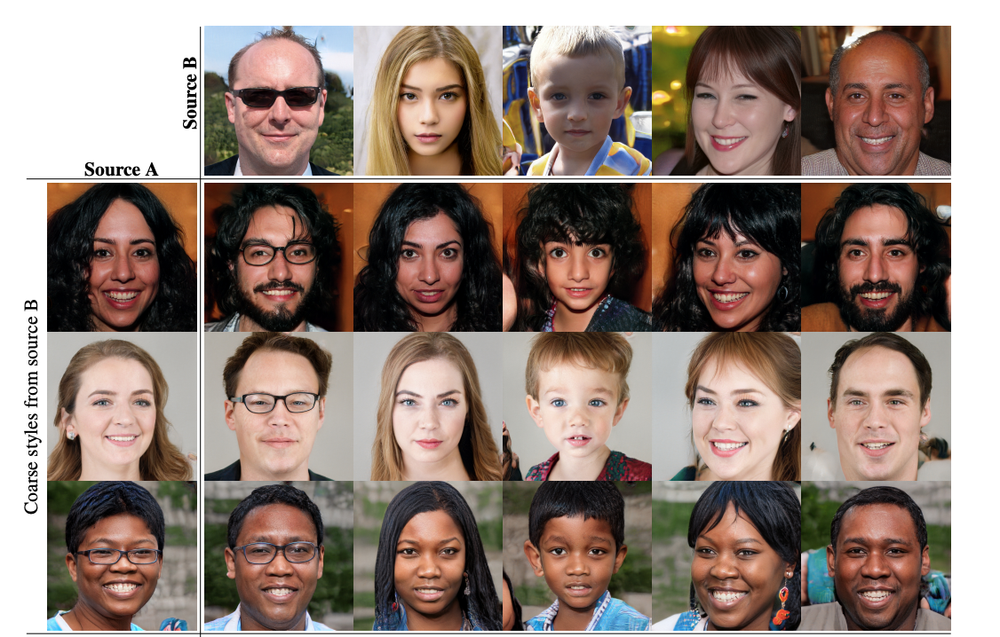

# 01_1 - StyleGAN
StyleGAN is an evolution of a traditional GAN (ProGAN). In order to understand which problems StyleGAN tries to solve 
and how this is done, it is necessary to understand how traditional GANs are structured.

## Traditionelle GANs
A GAN consists of a generator and a discriminator. The generator is trained to generate latent features and combine these.
Examples for latent features are general shapes, body sizes or colors.
The discriminator trains itself to distinguish "real" images from "fake" ones. The output of the discriminator
is the probability it estimates whether the image is real.
The two are in constant competition, with the generator trying to produce images that are accepted by the discriminator.
In the ongoing exchange, both parties improve further and further.

## Issues with traditional GANs.
When generating high-resolution/photorealistic images, it is very difficult with traditional GANs to understand the
synthesis process and the latent space interpolation.
Due to the opaque synthesis network, it is also very difficult to compare different generators.
It is also not possible to change the generator to control the synthesis process.
Another difficulty can be the generation of latent features based on the input vector. A latent feature should be 
independent of other factors. An example of this is that, for example, a person's weight is a poor factor to evaluate if
someone is overweight, since height also plays a crucial role. A better factor would be, for example, BMI.
Accordingly, one tries to keep the latent factors as less complex as possible, but in reality this is often not quite 
feasible (keyword: unavoidable entanglement).

## How does StyleGAN work?

### Mapping
As input, StyleGAN also gets a latent vector (z), which is normalized.
To solve the problem of the unavoidable entanglement, a so-called mapping network is used. This mapping network
consists of eight interconnected fully-connected layers and
creates a new vector (W) from the input, which contains the information to generate each style block.
This is done with the goal of creating an untangled latent feature space that does not contain any feature combinations.

### Synthesis Network
Unlike traditional GAN, where the input vector(Z) is entered into the first deep network layer,
in StyleGAN, the intermediate latent space(W) created by the mapping is given to the different style blocks.
An operator(A) is trained separately for each layer to transform the newly generated vector(W) into the respective layer.
The first network layer is also not given the input vector(Z), but a constant matrix trained in advance.
This is done because it was found that the network has no more benefit from being given the latent code.
The remaining synthesis network consists of a string of style blocks, which receive the information of the operator(A) 
of the mapping network and the noise (B).

### Style blocks
A style block consists of a 3x3 convolution, an AdaIN, optionally an upsampling and the input of the trained
operation based on the latent vector(w) and the noise(B).
Each style block trains a scaling factor (bi) which is multiplied by the noise. The scaling factor gives the weighting
of the noise. The noise is used to generate stochastic variation (e.g. differences in the generation of hair).
An AdaIN replaces a pixel normalization and consists of a normalization and a modulation. The goal of the AdaIN is
to generate a pair of style values based on W and to add this style to the feature map. A style is a
major attribute to the data.

Since the learning is based on a constant input and the change of the respective convolution layer is based on a latent, 
it is possible to control the strength of the style.

## Differences in the versions
### StyleGAN2
StyleGAN2 fixes the problem with "waterdroplets".

The hypothesis for why StyleGAN1 has those water droplets is, "that it creates a strong, localized spike that dominates
the statistic, so the generator can effectively scale the signale as it likes elsewhere".
To fix this behaviour there were some changes done to the synthesis network.
1. The initial noise and normalization were removed.
2. The addition of Noise(B) has been moved outside the style blocks. This leads to more predictable results.
3. The mean has been removed from normalization and modulation, since the standard deviation alone is sufficient.
4. Mod std and conv operations have been combined to simplify the architecture
5. Standard std has been changed to weight demodulation. This is done to allow the style blocks to base their 
   information on statistical assumptions rather than on the actual content of the feature map.

### StyleGAN2-ADA
The goal of StyleGAN2-ADA is to add functionality to train the GAN with limited data. ADA is an abbreviation for
Adaptive Discriminator Augmentation.

### StyleGAN3
The goal of StyleGAN3 is to fix texture sticking and make transition animations more natural.

This is done by removing unintended position references.
Unintentional Positional-References cause the network to stick to the same coordinates and were found in Image Borders,
Per-Pixel Noise Inputs, Positional Encodings, and Aliasing, where Aliasing was the main source of problems.

Aliasing occurs when the tested signal frequency is too low. Specifically, they occur with upsampling filters and
Nonlinearities (ReLu). To address this behavior, network layers need to work with continuous feature maps instead of
discrete feature maps and the noise must be removed.

To go from discrete feature maps to continuous feature maps, you need to apply a low-pass filter.
To get from a continuous feature map to a discrete feature map, you just need to pickpocket points.

The new architecture looks like this:

## Tricks
## Truncation Trick
A problem with the training of the network can be that there is not enough data to train a specific style.
A solution for this can be the so-called truncation trick.
With the Truncation Trick so-called low-probability regions (in z or also w) are ignored. This improves the
quality of the image at the expense of the variation.
The trick should only be applied to low-resolution layers (coarse features).
The formula looks like this:

Psi is a value from -1 to 1, where 0 indicates the average image.
If this value is now changed, you will see large attributes change.

### Style Mixing
With the help of Style Mixing it is possible to make changes to the synthesis of the image. Here it is possible to link
the result of different mapping networks to different style blocks.
Thus, it is possible to exchange different latent vectors with variable selectable style blocks and to mix images on
different layers with each other.
A certain part of the network is also trained with the mixing of several randomly generated codes.
Ex: Pose, Hairstyle, Face shape from code A and Eyeglasses, colors, finer facial features from code B.

## Disadvantages
One problem with StyleGAN is that it cannot learn unstructured data (e.g. landscapes).
So it needs an image, which it can divide into different structures.
Furthermore, StyleGan3 has no noise anymore. So the generator is relatively slow, because it has to generate random 
numbers during the training.
Lastly, you need a pretrained network to produce of picture of a specific styling.

## Sources
- https://arxiv.org/pdf/1812.04948.pdf
- https://nvlabs-fi-cdn.nvidia.com/stylegan3/stylegan3-paper.pdf
- https://medium.com/@steinsfu/stylegan-vs-stylegan2-vs-stylegan2-ada-vs-stylegan3-c5e201329c8a
- https://jonathan-hui.medium.com/gan-stylegan-stylegan2-479bdf256299
- https://en.wikipedia.org/wiki/StyleGAN
