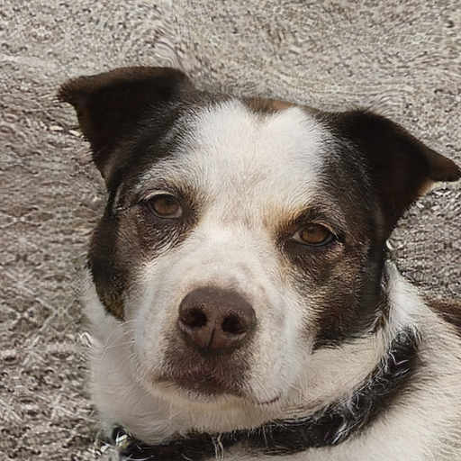
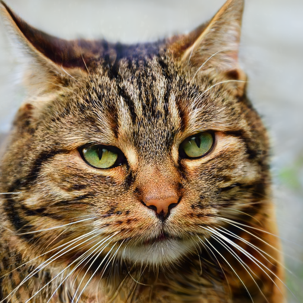
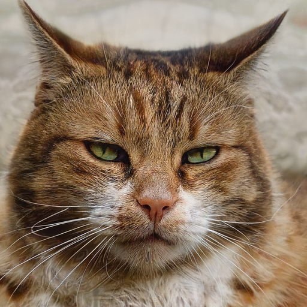

# 04 - Linearcombination
## Task
The task was to morph two images together using a simple linear combination. The relevant code is [here](../stylegan3/a1_linearcombination.py).

## Implementation
- For the implementation we used a pre-trained GAN from NVidia.

- We created the latent vectors using seeds from the official Stylegan3.
```python
# generate and return latent based on a seed
def generate_latent(self, seed):
    return torch.from_numpy(np.random.RandomState(seed).randn(1, self.network.z_dim)).to(self.device)
```

- To morph the images, we used a simple linear combination with an associated weight (between 0 and 1).
```python
# generate linearcombination of two latents based on a given weight
@staticmethod
def calculate_linearcombination(weight, latent1, latent2):
    return (weight * latent1) + ((1 - weight) * latent2)
```

- For later experiments (with the encoding), we also implemented a version that uses the styleblocks instead of the latent representation. 
TODO Code einfügen

## Results
Interpolation over latent representation

| Latent1                                        | Latent2                                        |
|------------------------------------------------|------------------------------------------------|
|  |  |
| Morphed                                        |
|  |

## Slider
Furthermore, we used the Python library Plotly to morph the images using a slider.
You can view the result in your web browser: 
[linearcombination.html](./results/1_assignment/a1_linearcombination.html)
