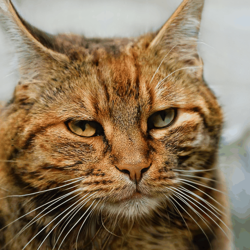
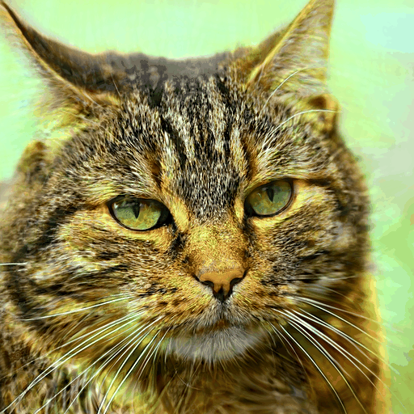
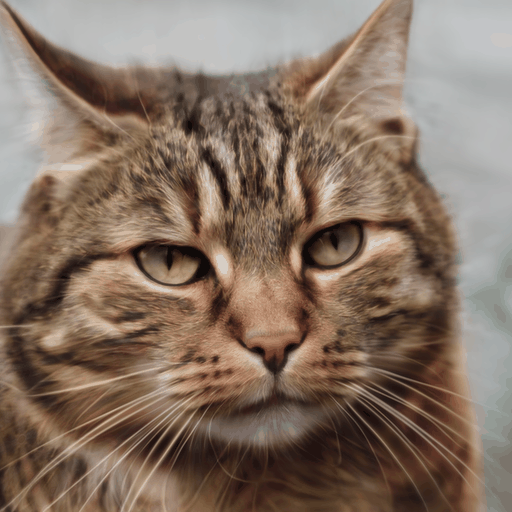

# 05 - Styleblocks
## Task
The task was to modify styleblocks by changing the mapped vector w.

## Implementation
- For the implementation we used a pre-trained GAN from NVidia.
- We created the latent vectors using seeds from the official Stylegan3.
- To modify a styleblock we got the mapping of the latent and modified the corresponding vector with a modification value.
```python
# modify a styleblock by adjusting the mapped vector w
def modify_styleblock(self, styleblock):
    w = self.network.mapping(z=self.latent, c=None)

    images = []

    # Interpolation
    for i in np.arange(0, 1, 0.1):
        w_clone = w.clone()
        img = self.modify_single_map(styleblock, w_clone, i)
        images.append(img)

    self.render_gif(images, styleblock)

# modify a single mapping vector and synthesize the result
def modify_single_map(self, styleblock, ws, modification):
    ws[0, styleblock] *= modification
    img = self.network.synthesis(ws=ws, noise_mode='const')
    img = (img.permute(0, 2, 3, 1) * 127.5 + 128).clamp(0, 255).to(torch.uint8)

    return img
```

- To render the result we created a .gif-file based on all synthesized images.
```python
# render a gif based on given images
    def render_gif(self, images, styleblock):
        video_out = imageio.get_writer(self.outdir+"/modified_styleblock_" + str(styleblock) + ".gif", mode='I')

        for frame_idx in range(len(images)):
            video_out.append_data(images[frame_idx][0].cpu().numpy())

        video_out.close()
```

## Results
You can find all results [here.](./results/2_assignment)  
Some examples:  




## Sourecode
```python
# Styleblocks modifies a single style by changing the mapped vector w
class Styleblocks:
    # constructor
    def __init__(self, network_counter, seed):
        self.fig = go.Figure()
        self.listOfNetworks = [
            'https://api.ngc.nvidia.com/v2/models/nvidia/research/stylegan3/versions/1/files/stylegan3-r-afhqv2-512x512.pkl',      # dogs/cats
            'https://api.ngc.nvidia.com/v2/models/nvidia/research/stylegan3/versions/1/files/stylegan3-t-metfacesu-1024x1024.pkl'  # TODO
        ]
        self.device = torch.device('cuda')
        self.network = self.load_network(self.listOfNetworks[network_counter])
        self.latent = self.generate_latent(seed)
        self.label = self.generate_label()
        self.outdir = './out'  # output directory if image is getting rendered

    # load and return network based on pickle and own device
    def load_network(self, network_pkl):
        print('Loading networks from "%s"...' % network_pkl)
        with dnnlib.util.open_url(network_pkl) as f:
            g = legacy.load_network_pkl(f)['G_ema'].to(self.device)  # type: ignore
        return g

    # generate and return latent based on a seed
    def generate_latent(self, seed):
        return torch.from_numpy(np.random.RandomState(seed).randn(1, self.network.z_dim)).to(self.device)

    # generate empty label
    def generate_label(self):
        return torch.zeros([1, self.network.c_dim], device=self.device)

    # modify a single mapping matrix and synthesize the result
    def modify_single_map(self, styleblock, ws, modification):
        ws[0, styleblock] *= modification
        img = self.network.synthesis(ws=ws, noise_mode='const')
        img = (img.permute(0, 2, 3, 1) * 127.5 + 128).clamp(0, 255).to(torch.uint8)

        return img

    # render a gif based on given images
    def render_gif(self, images, styleblock):
        video_out = imageio.get_writer(self.outdir+"/modified_styleblock_" + str(styleblock) + ".gif", mode='I')

        for frame_idx in range(len(images)):
            video_out.append_data(images[frame_idx][0].cpu().numpy())

        video_out.close()

    # modify a styleblock by adjusting the mapped vector w
    def modify_styleblock(self, styleblock):
        w = self.network.mapping(z=self.latent, c=None)

        images = []

        # Interpolation
        for i in np.arange(0, 1, 0.1):
            w_clone = w.clone()
            img = self.modify_single_map(styleblock, w_clone, i)
            images.append(img)

        self.render_gif(images, styleblock)
```