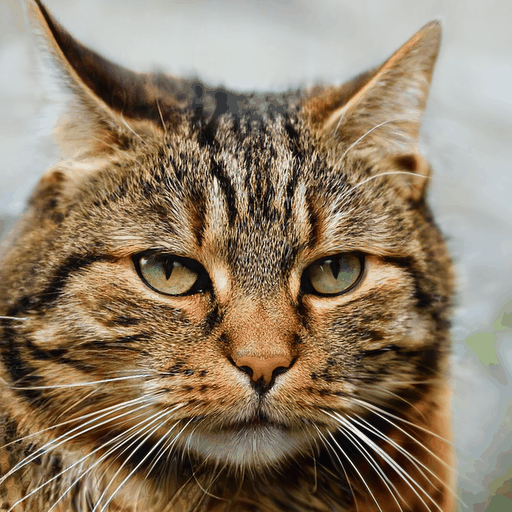
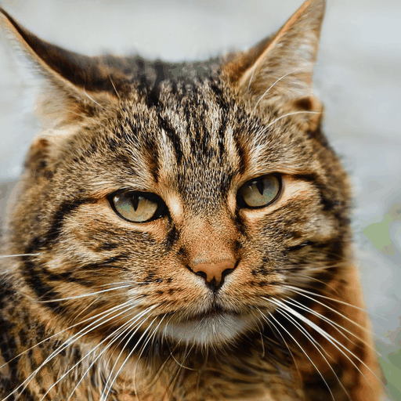
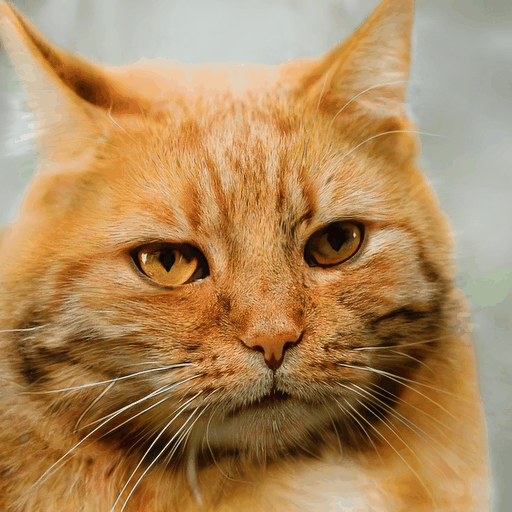

# 05 - Styleblocks
## Task
The task was to modify styleblocks by changing the mapped vector w. The relevant code is [here](../stylegan3/a2_styleblocks.py).

When generating an image from a latent vector, Stylgan uses an intermediate latent representation besides the initial vector z,
referred to as styleblocks (or w in code).
The 16 styleblocks of an image can be modified, which should correspond to changes in low- or high-level features.


## Implementation
- For the implementation we used a pre-trained GAN from NVidia.
- We created the latent vectors using seeds from the official Stylegan3.
- To modify a styleblock we used w, the mapping of the latent z, and multiplied one block at a time with a modification value.
```python
# modify a styleblock by adjusting the mapped vector w
def modify_styleblock(self, styleblock):
    w = self.network.mapping(z=self.latent, c=None)

    images = []

    # Interpolation
    for i in np.arange(0, 1, 0.1):
        w_clone = w.clone()
        img = self.modify_single_map(styleblock, w_clone, i)
        images.append(img)

    self.render_gif(images, styleblock)

# modify a single mapping vector and synthesize the result
def modify_single_map(self, styleblock, ws, modification):
    ws[0, styleblock] *= modification
    img = self.network.synthesis(ws=ws, noise_mode='const')
    img = (img.permute(0, 2, 3, 1) * 127.5 + 128).clamp(0, 255).to(torch.uint8)

    return img
```

- To render the result we created a .gif-file based on all synthesized images.
```python
# render a gif based on given images
    def render_gif(self, images, styleblock):
        video_out = imageio.get_writer(self.outdir+"/modified_styleblock_" + str(styleblock) + ".gif", mode='I')

        for frame_idx in range(len(images)):
            video_out.append_data(images[frame_idx][0].cpu().numpy())

        video_out.close()
```

## Results
You can find all results [here.](./results/2_assignment)
Some examples with a factor between 0 and 1: 

| Block 0                                                              | Block 1                                                              |
|----------------------------------------------------------------------|----------------------------------------------------------------------|
|      |      |

| Block 7                                                              | Block 8                                                              |
| -------------------------------------------------------------------- | -------------------------------------------------------------------- |
|      |      |

| Block 14                                                             | Block 15                                                             |
| -------------------------------------------------------------------- | -------------------------------------------------------------------- |
|    |    |

We rendered one example, where styleblock 15 had weights from -1 to 1 [here.](./results/2_assignment/modified_styleblock_15_negative.gif)
