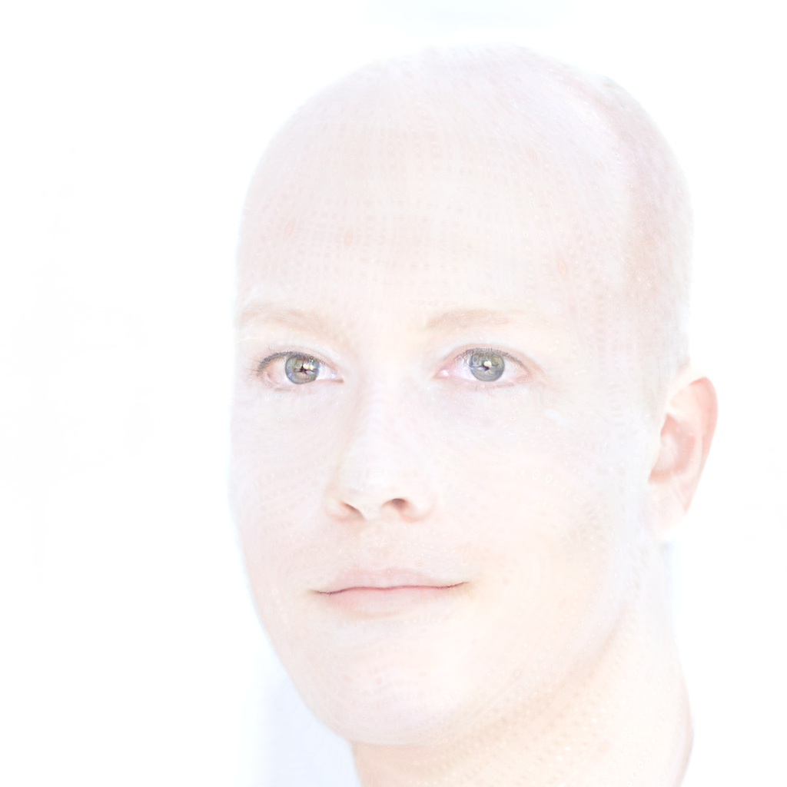
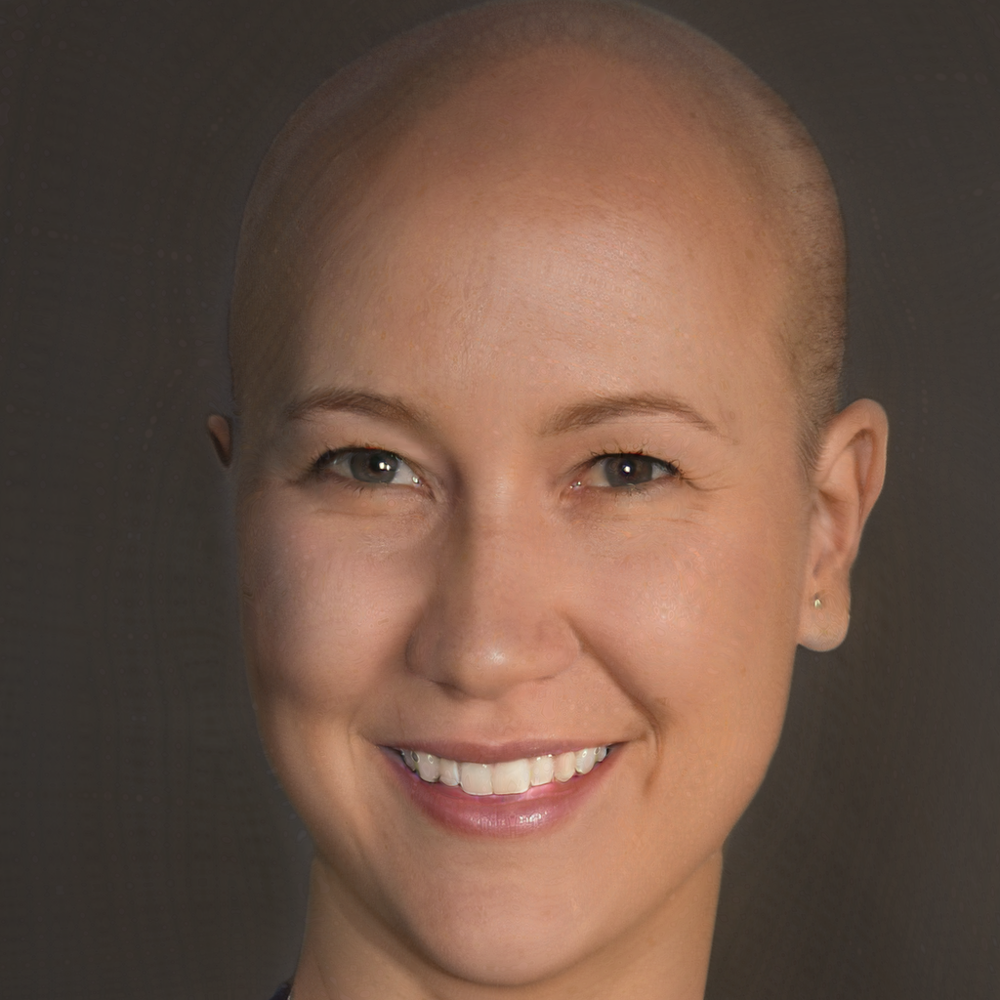
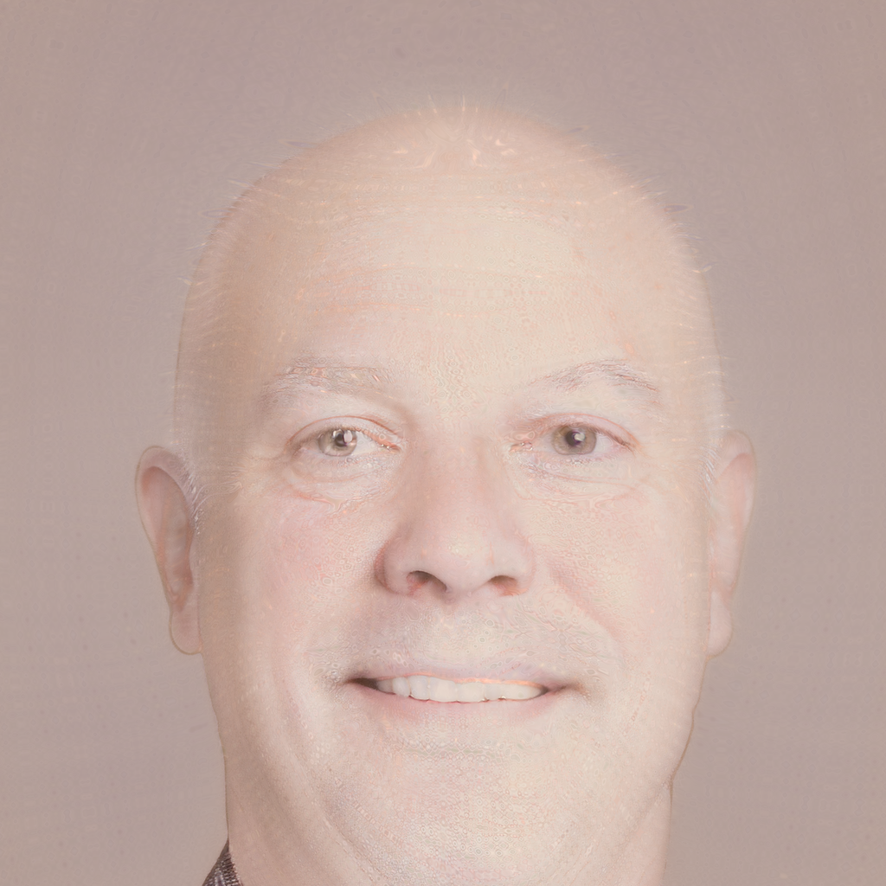
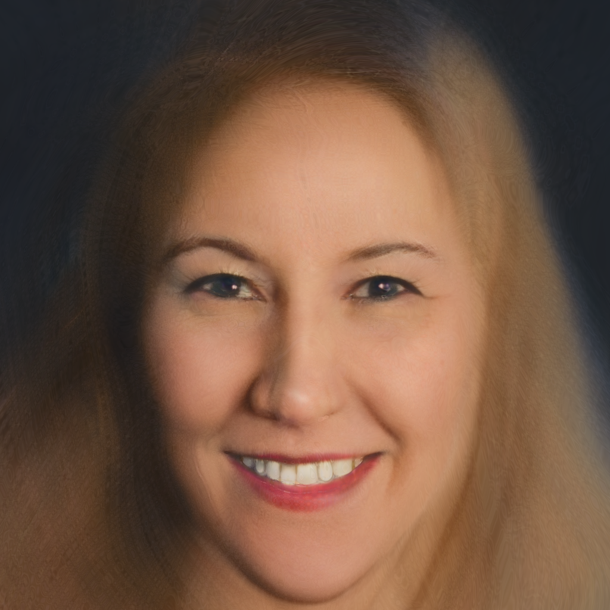

# 07 - Stylegan3 Encoding
How to transfer input images to latent space.
The relevant code is [here](../stylegan3/a4_encoder.py). 

## Task
The task was to find a good latent vector to represent a given image.
On top of that we should research if it is better to find the latent vector in z (512 elements in a vector) or w (16 Styleblocks with 512 entries each).

Finally, we should encode images of ourselves and morph these together with a slider.

## General idea

StyleGAN generates images from a latent vector z with 512 entries. We start by using a random vector z, compare the generated image with the target image with a loss function and apply backpropagation to the entries of z. z therefore changes gradually until the generated image resembles the target image. 

The same procedure can be applied to the styleblocks w instead of z, as they are an intermediate representation of z while generating the image. 

## Implementation
In this section, we will explain some parts of our implementation and highlight some problems we encountered and how we tried to solve them. 

### Reading and writing the images
We used the PIL library to read and write the image files. 

The generated images have values in a range of [-1,1]. We used code from the StyleGAN repository to save the generated images, which shifts and scales these values so that the final saved image has values in [0,255].  

An inverse transformation has to be applied when loading images that are in [0,255]. Otherwise the images are brighter than intended and comparing them to generated images from the StyleGAN network leads to incorrect high loss values and eventually to a bad encoding. 

This table illustrates the problem:
| Correct image                              | Naively loaded image                         | Result of the encoding                            |
|--------------------------------------------|----------------------------------------------|---------------------------------------------------|
|  |  |  |
  
An additional step when reading images is to normalize them, so that their mean and standard deviation are similar to the dataset that is used by the generator. 
In the beginning of the project, we simply used images that were generated by the StyleGAN visualizer to avoid such problems. (This also helped with possible alignment problemes of the faces, since the used 1024x1024 model generates most faces in the center of the images.)\
Later we calculated an approximated mean and standard deviation over randomly generated images from StyleGAN and each image that we load is now being normalized. Since this leads to a perceptually very different image, the normalization is inverted when saving output images. 

TODO: normal_white face wurde rot, johannes mit/ohne/ohne inverse

### Loss Function
We found that, beside the learning rate, the loss function was the main thing we needed to tune in order to get useable results from our projection algorithm. In the end we settled on a weighted combination of the two loss functions elaborated below.
#### MSE Loss
We initially choose the Mean Square Error function to calculate our loss. Since there already is a pytorch implementation this was easily implemented. 
However we quickly noticed that our algorithm had trouble with facial features and would sometimes just generate blobs of a similar colour to the target image. 
Consequently we implemented a second loss function, that would be better at rating the facial features of our outputs.

#### Perceptual Loss
We choose a perceptual loss function that uses the VGG16 network as a classifier. 
After adding this loss we saw an improvement in the facial features of our output images and we greatly reduced the chance of generated images not looking like faces at all.
We did however encounter a new problem. A lot of the images we generated were clearly human faces but these images were not very similar to our target image.
Often the rotation and position of the head was right and the distance between facial features seemed fine, but hair was sometimes wrong or completely lacking and othere details also seemed off (for some reason we kept generating old men instead of the target man/woman seen in other examples).
What we realized was, that the perceptual loss generates much bigger values than our MSE loss (MSE loss would be between 0 and 1, perceptual loss at ~8) and since we just added both loss functions together, this meant that the MSE loss did not matter much during the backpropagation.
To fix this we simply increased the weight of the MSE lot by a factor of ~10 (see below).1024x1024 TODO?

#### Weighting both loss functions

Once we started to encode our own pictures we noticed that an optimal weight between the loss functions would differ from image to image.
With the same weights that yielded great results on one image, we got only washed out colours on another.
This inspired us to dynamically adjust the weights for each individual target image.
In order to do this we would train the first epoch of our algorithm multiple times with a different combination of weights for the MSE and perceptual loss.
We would then rate the resulting image by calculating the MSE between it and the target image and compare these values for all combinations.
The best combination of weight would be used in further training.
Even though this wastes a few epochs of training we found that this greatly reduced the chance of the encoding yielding unusable results (The weights we try are: MSE [0, 10, 30] and perceptual [0, 5, 10]; totaling 9 combinations/epochs we need to try out).

| Target Image                                                 | MSE and Perceptual Loss                                         |
|--------------------------------------------------------------|-----------------------------------------------------------------|
|      |      |
| Only MSE Loss                                                | Only Perceptual Loss                                            |
|  |  |

TODO rerun experiments

### Learning Rate and Scheduler
When using backpropagation and gradient descent, the speed of learning is an important factor.

We used the Adam optimizer to handle most details of backpropagation. It takes a learning rate as a parameter, which is usually between 0.1 and much smaller values like 0.000001. 
Fast learning rates can lead to no progress at all, because the steps of gradient descent are way too large to converge.
Too small learning rates cause long learning times until the result improves. 

https://www.jeremyjordan.me/nn-learning-rate/

Therefore, a scheduler can be used to modulate the learing rate over the course of the training. 

We tried two different schedulers:
- The exponential scheduler decreases the learing rate, so that the initial convergence is fast, but the longer optimisation is less likely to loose the already found minimum.
- The OneCycleScheduler slowly increases the learing rate. 
While developing the code, we had the problem that convergence happened relativly quick, the loss function was low and a large part of the time was wasted on small, nearly imperceptable changes. However, the image was (for us) not very similar to the target image. The main issue was probably a bad loss function, which we later modified (as already discussed above), but it lead us to thinking, that we should slow the first convergence process down to provide the possibility for more variation (in more iterations)

In the end, we tried different static learning rates as well as the two schedulers with different settings, but did not find significant changes. We setteled on an exponential decay with in initial learning rate of 0.05 and a factor of 0.9 with which it is mutiplied at each epoch. 

### Encoding into the latent space of z or w?
When we encode an image into a latent represantation in stylegan3 we have the choice of encoding it into the initial latent vector of z (512 values) or into the styleblocks w (16 * 512 values).
We initially choose z and after tuning all the other hyperparameters we got great result for our test images (generate by stylegan).
When we encoded the images in z we got sharp results that very closely resembled our input image, if we encoded into w however the images were more washed out and especially the edges were quite blurry; we also needed considerably more iterations to get similar results, when encoding into w.
Once we started using our own images we noticed that encoding into z did not work at all, at best we would get human faces with no resemblance to our own, at worst we would just generate random shapes.
Encoding into w did work with our own images did work for our own pictures and looked fairly good (edge regions are unsharp, hair is sometimes wierd).
Thus we were forced to stick with encoding into w in order to make most images work in our algorithm.
In summary z worked very well for us on some images(mostly taken from stylegan) and produced sharp images when it did work, but w seemed to work more consistently on a wider range of images (most notably our own images) at the cost of taking longer to process and producing a little more washed out images.

| Target Image                                 | Encoding into z                             | Encoding into w                           |
|----------------------------------------------|---------------------------------------------|-------------------------------------------| 
|  |  |  |

### Search best seed    
One other trick we used is an improvement of our starting latent.
We usally start with random noise, but random noise also correlates to an image of a face in stylegan, and we noticed that if said face is similar to our targe image our algorithm will have an easier time and if the starting image is too different from our target image the backpropagation might not work at all.
We implemented a search for a good starting latent, where we iterate over a number of different, random latents and compare the corresponding images to our target using MSE.
The best latent is then choosen and used as our stating point for the backpropagtion.
 
### Dataset
StyleGAN was trained on different datasets. The content of the images (photos of faces, painting of faces, animals,...) as well as the resolution (256x256, 512x512, 1024x1024) varies between the datasets. 
Additionally we found that the 1024-model for photos of faces generates images with faces in the center of the image, while the smaller 256-model generates the faces somewhere in the image, sometimes even only partially in the image. 

We did not achieve good results on the smaller images and we think that it is due to the missing alignment and therefore missing similarity between those images. 
(But it could also be the case that we tried the smaller model too early and something else was wrong with our code at that time. TODO)

## Results

### Images

### Slider

# Sources
- How to Embed Images Into the StyleGAN Latent Space  
  https://openaccess.thecvf.com/content_ICCV_2019/papers/Abdal_Image2StyleGAN_How_to_Embed_Images_Into_the_StyleGAN_Latent_Space_ICCV_2019_paper.pdf
- VGG Perceptual Loss Implementation
  https://gist.github.com/alex-vasilchenko-md/dc5155f96f73fc4f67afffcb74f635e0
