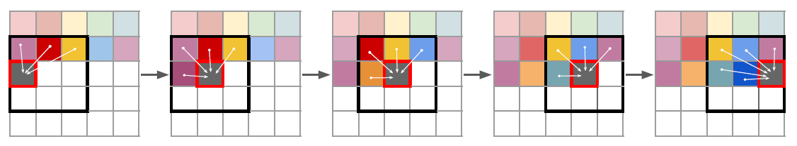

# 01 - Architektur & Tricks
## Stylegan
Wieso? Was löst Stylegan?

### Versionsunterschiede
1, 2, 3

### Mapping und Synthesis Network
Foo Bar

### Common Tricks
+ Truncation Trick:
+ Todo
+ Todo

### Was sind Styleblocks?
Wie enforced?

### Vorteile
Wieso? Welches Problem löst Stylegan?

### Nachteile
Welche Probleme hat Stylegan?

## VQGan

### Ergebnisse

1. Depth-to-image on RIN
2. Stochastic superresolution on IN
3. Semantic synthesis on S-FLCKR
4. Semantic synthesis on S-FLCKR
5. Edge-guided synthesis on IN.

### Vorteile / Tricks im Paper

Problem: Generative Modelle können Bilder aus Rauschen generieren, aber wir wissen nicht, wie wir an die Bilder kommen, die wir haben wollen. 
CLIP: Contrastive Language–Image Pre-training

## Biggan
- Inception Score: Bewerte Eindeutigkeit einzelner Bilder und Variation der Gesamten Bildmenge mit einem klassifizierenden Netz
- Fréchet Inception Distance: Vergleicht generierte Bilder mit einem gegebenen Datensatz mithilfe von inception v3 ohne das letzte Layer
- Orthogonal Initialization: w wird als orthogonale Matrix initialisiert, was explodierende/verschwindende Gradienten vorbeugt

### Vorteile/Ziele
- Im vergleich zu vorherigen Netzten wurden 4x so viele Parameter und eine 8x größere Batch Size verwendet, verbessert IS und FID stark
- Ist class conditional und kann für die meisten gelernten Klassen diverse und scharfe, realistische Bilder erstellen
- Truncation Trick ermöglicht Kompromiss zwischen Schärfe und Variation

### Nachteile/Probleme
- Das Training ist extrem instabil, da der Diskriminator zum Overfitten tendiert (wird durch beenden des Trainings vorm Zusammenbrechen umgangen)
- Einige Bilde weisen Class-Leakage auf, wobei Attribute verschiedener Klassen verschmelzen
- Einige Klassen können schlecht gelernt werden (z.B. Menschenmengen) und weisen Mode-Collapse auf

# 02 - Installation
Repo: https://github.com/NVlabs/stylegan3

# 03 - Einfache Anwendung
